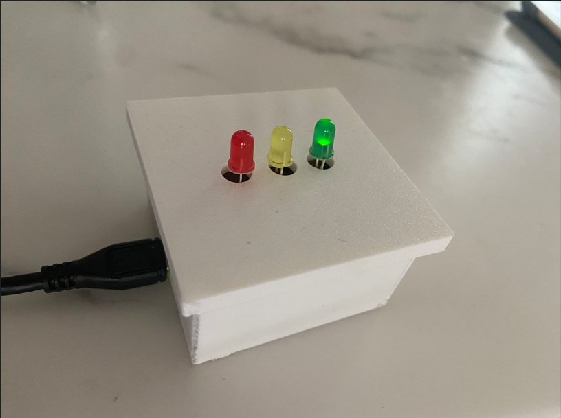

# Home Device Detector

This project implements an embedded sound recognition system that assists Deaf and hard of hearing (DHH) individuals🧏 by detecting and classifying critical household sounds (smoke alarms and doorbells) and providing visual alerts through LEDs.


## Project Overview

The Home Device Detector addresses accessibility barriers for DHH individuals in smart homes by developing a TinyML-based embedded system that can:

- Detect critical household sound events in real-time⏰
- Classify between normal ambient sounds, doorbell rings🔔, and smoke alarms🚨
- Provide immediate visual feedback through color-coded LED indicators💡
- Process audio locally for enhanced privacy and reduced latency




### Features

- Real-time detection of 3 sound categories:
  - Normal environmental sounds
  - Doorbell rings
  - Smoke alarms
- Visual feedback through LED indicators:
  - Green🟩 for normal environment
  - Yellow🟨 for doorbell alerts
  - Red🟥for smoke alarm detection
- Fast response time (within 2 seconds)
- Compact 3D-printed enclosure for easy placement
- Serial monitoring interface for debugging

## Hardware Requirements

- Arduino Nano 33 BLE Sense
- 3× LEDs (Green, Yellow, Red)
- 3× 220Ω resistors
- Breadboard or stripboard circuit connections
- 3D-printed enclosure (optional)
- USB cable for power and programming

## Software Dependencies and Resources

- Arduino IDE
- [Autodesk Fusion](https://www.autodesk.com/uk/products/fusion-360/overview?term=1-YEAR&tab=subscription) (for 3D modeling)
- [PrusaSlicer](https://www.prusa3d.com/page/prusaslicer_424/)(for 3D printing)
- [Edge Impulse](https://edgeimpulse.com/) Platform
- Model library exported from Edge Impulse for [Home Device Detector](/ei-homedevicedetector-arduino-1.0.21.zip)

## Installation

1. Clone this repository:

   ```
   git clone https://github.com/Youngwer/TML_HomeDeviceDetector.git
   ```

2. Open the Arduino sketch [(`TML_HomeDeviceDetector.ino`)](/TML_HomeDeviceDetector/TML_HomeDeviceDetector.ino) in the Arduino IDE.

3. Install the required libraries through the Arduino IDE via:

Sketch > Include Library > Add .ZIP Library>ei-homedevicedetector-arduino-1.0.21.zip

4. The Edge Impulse model is already included in the repository as the `HomeDeviceDetector_inferencing` library. If you want to modify or retrain the model:

   - Create an account on [Edge Impulse](https://studio.edgeimpulse.com/)
   - Follow the instructions in the report to recreate the model
   - Export the model as an Arduino library
   - Replace the existing model files in the repository

5. Connect the hardware components according to the circuit diagram shown below:


   - Connect the Green LED to pin D2 through a 10kΩ resistor
   - Connect the Yellow LED to pin D3 through a 10kΩ resistor
   - Connect the Red LED to pin D4 through a 10kΩ resistor

6. Upload the sketch to your Arduino Nano 33 BLE Sense.

## Usage

Once the system is powered on and initialized:

1. The device will continuously monitor ambient sounds through the onboard microphone.
2. When a sound event is detected, the corresponding LED will illuminate:
   - Green LED: Normal environmental sounds
   - Yellow LED: Doorbell detection (with distinctive blinking pattern)
   - Red LED: Smoke alarm detection (with rapid blinking pattern)
3. Connect to the serial monitor (115200 baud) to view detailed classification results and debugging information.

## System Architecture

The system is implemented in a single Arduino sketch file:

- **TML_HomeDeviceDetector.ino** - Contains all functionality including audio capture, processing, inference, and LED control

This monolithic approach simplifies the codebase while still providing clear organization through different code sections and functions.


### Data Processing Pipeline

1. Continuous audio sampling through built-in microphone on the board
2. Pre-processing of audio data (windowing, normalization)
3. Feature extraction using Mel-Frequency Energy (MFE) spectrograms
4. Inference using the quantized TensorFlow Lite model
5. Classification of sound events based on confidence thresholds
6. Visual feedback through LED indicators

Below is a diagram show how the system work.


## Model Training

The model was trained using Edge Impulse with the following workflow:

1. Data collection from multiple sources:
   - Online audio repositories for doorbell and smoke alarm sounds
   - Smartphone recordings for ambient environmental sounds


2. Dataset preparation with balanced class distribution:
   - Smoke alarm: 1 minute 42 seconds
   - Doorbell sounds: 1 minute 50 seconds
   - Normal environmental audio: 1 minute 56 seconds
   - 80:20 train/test split


3. Feature extraction using MFE spectrograms:
   - Window size: 1000ms
   - Window increase: 500ms
   - Sampling rate: 16kHz
   - 48 filters and 2048 FFT length


4. Neural network architecture:
   - Convolutional layers with optimized filter configurations
   - Dropout regularization to prevent overfitting
   - Dense layers for final classification


5. Model optimization and quantization:
   - Final accuracy: 94.9% (training), 90.32% (testing)
   - Model size optimized for Arduino deployment


## Calibration and Tuning

The system uses a confidence threshold parameter that can be adjusted in the code:

```cpp
#define CONFIDENCE_THRESHOLD 0.8 //80% confidence threshold
```

This threshold determines how confident the model must be to trigger an alert. You can adjust this value (between 0.0 and 1.0) based on your specific environment to balance between sensitivity and false positives.

## Performance

The system:

- Samples audio continuously at 16kHz
- Processes audio in 1-second windows
- Delivers visual alerts within 2 seconds of sound detection
- Achieves over 90% accuracy in sound classification
- Uses approximately 65% of the Arduino's available memory

The signal processing approach uses a sliding window with prediction smoothing:

```cpp
// Smooth prediction results
static float normal_prob_avg = 0.0;
static float doorbell_prob_avg = 0.0;
static float smokealarm_prob_avg = 0.0;
static int prediction_count = 0;

// In the loop
// Smooth prediction results
normal_prob_avg = (normal_prob_avg * prediction_count + normal_prob) / (prediction_count + 1);
doorbell_prob_avg = (doorbell_prob_avg * prediction_count + doorbell_prob) / (prediction_count + 1);
smokealarm_prob_avg = (smokealarm_prob_avg * prediction_count + smokealarm_prob) / (prediction_count + 1);
prediction_count++;
if (prediction_count >= EI_CLASSIFIER_SLICES_PER_MODEL_WINDOW) {
    prediction_count = 0;
}
```
When device detects home device sound like doorbell, the serial monitor will print information shown below


## Enclosure Design

The 3D-printed enclosure was designed using Fusion 360 and includes:

- Mounting points for the Arduino Nano 33 BLE Sense
- Openings for the USB connection
- Optimal positioning for the onboard microphone
- Diffusion windows for the LED indicators

[STL files](/3D%20Model/HomeSoundDetector.stl) for the enclosure are included in the `/3D Model` folder.


## Troubleshooting

- If the LEDs don't illuminate, check your connections and resistor values
- If certain sounds aren't recognized correctly, try adjusting the confidence threshold
- If the device becomes unresponsive, check the serial monitor for memory-related errors
- Ensure the microphone opening in the enclosure isn't obstructed

## Future Improvements

- Add support for more household sound categories (microwave, kettle, etc.)
- Implement haptic feedback through vibration motors
- Add Bluetooth connectivity for smartphone notifications
- Develop adaptive audio filtering for noisy environments
- Include a battery power option for portable use

## Acknowledgments

- UCL Centre for Advanced Spatial Analysis ([CASA](https://www.ucl.ac.uk/bartlett/casa))
- Edge Impulse for the embedded machine learning platform
- Arduino community for libraries and support
- Online sound repositories ([Pixabay](https://pixabay.com/sound-effects/), [Uppbeat](https://uppbeat.io/sfx)) for training data

## Author

Wenhao Yang - [GitHub](https://github.com/Youngwer)

------

Project created as part of the CASA0018 - Deep Learning for Sensor Networks course at University College London.